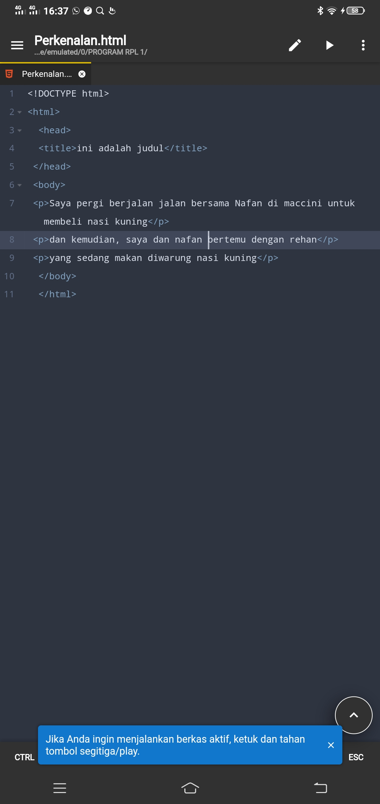
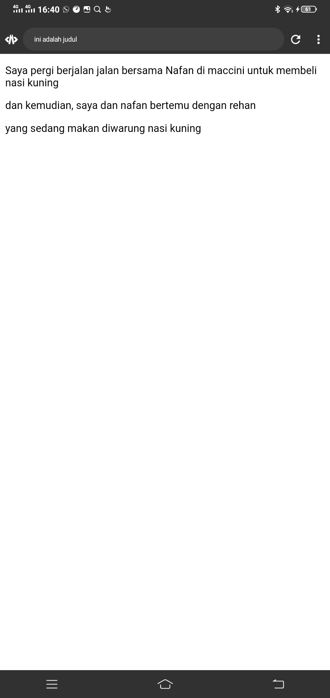

# perekanalan Html

## teks  program
```
<!DOCTYPE html>
<html>
  <head>
  <title>ini adalah judul</title>
 </head>
 <body>
 <p>Saya pergi berjalan jalan bersama fadhil di maccini untuk membeli nasi kuning</p>
 <p>dan kemudian, saya dan fadhil bertemu dengan rehan</p> 
 <p>yang sedang makan diwarung nasi kuning</p>
  </body>
  </html>
```

## PROGRAM



## HASIL



# anatomi ELEMEN HTML
## penjelasan program

Anatomi elemen HTML merujuk pada struktur dasar atau komponen-komponen yang membentuk suatu elemen dalam HTML. Anatomi ini mencakup beberapa elemen utama seperti tag pembuka, tag penutup, atribut tag, isi/konten tag, dan tag-tag dasar.

 Elemen adalah suatu kesatuan dari sebuah tag yang dimulai dari tag pembuka hingga ke tag penutup. Elemen HTML secara garis besar terdiri atas tiga bagian yaitu tag pembuka konten/isi


-  `<a>` adalah elemen dasar untuk membuat link di HTML dan termasuk di tag pembuka.
- herf= adalah nama atribut yang menghubungkan antara halaman web.
- `https://www.instagram.com`adalah nilai atribut yang digunakan untuk mengakses subuah link. 
- Isi konten itu untuk masuk ke URL/link yang sudah kiita buat di atrbut `href` yaitu klik link.  Dalam HTML, tag pembuka dan penutup digunakan untuk menandai awal dan akhir dari suatu elemen dalam dokumen. Ini membantu browser memahami struktur dan tata letak konten.


Berikut ini adalah penjelasan singkatnya:

- Tag Pembuka `(<tag>)` Membuka elemen HTML dan menunjukkan awal dari suatu bagian dalam dokumen.
- Tag Penutup `(</tag>`) Menandakan akhir dari suatu elemen HTML yang telah dibuka dengan tag pembuka.

- Atribut Tag
Elemen dalam HTML dapat memiliki atribut yang memberikan informasi tambahan tentang suatu elemen informasi yang bisa berupa instruksi untuk memberi warna, teks, dan menggatur besar huruf teks. Setiap atribut memiliki pasangan nama dan nilai (value), dan ditulis dengan nama"nilai", Value/nilai boleh menggunakan tanda kutip satu (') atau dua ("). Setiap tag memiliki atribut tertentu dan tidak sembarangan. Sehingga kita harus perlu mempelajari tag beserta atribut yang tepat untuk digunakan pada tag tersebut. Sebagai contoh, atribut href dapat digunakan pada tag ``<a>`` dan memiliki nilai atribut yang khusus yaitu berupa link halaman web yang ingin diarahkan. Contoh atribut lain seperti width untuk mengatur lebar dan heigt untuk mengatur tinggi dari sebuah gambar yang digunakan pada tag .

- Konten/isi Tag
Objek yang dikenal sebagai perintah tag, letaknya berada di antara tag pembuka dan tag penutup biasanya apa yang dituliskan diantara tag pembuka dan tag penutup akan ditampilkan pada halaman website dan mempresentasikan hasil dari penggunaan tag beserta atributnya.

Sebagai contoh, tag yang menampilkan tulisan klik google, yang dimana teks tersebut jika di klik akan mengarahkan kita ke nilai atribut href yaitu url google, `(https://www.intagram.com)`. Perlu diketahui fungsi tag `<a>` atau "anchor" akan mengarahkan pengguna web menuju link halaman web tertentu.

### Tag Dasar 
Tag dasar dalam pemrograman web biasanya merjuk pada elemen-elemen HTML (Hypertext Markup Lenguage) yang digunakan untuk membangun struktur dasar halaman web.

Berikut adalah beberapa tag dasar:

1. `<!DOCTYPE html>`

- Menentukan versi HTML yang digunakan dalam dokumen.

2. `<head>`

- Berisi informasi metadata dokumen HTML, seperti judul dan link ke stylesheet.

3. `<title>` 

- Menentukan judul dari dokumen HTML.

4. `<body>`

- Berisi konten utama dokumen HTML.

5. `Heading <h1> hingga <h6>`

- Menandai tingkat heading dari 1 (terbesar) hingga 6 (terkecil).

6. `<p>`

- Menandai paragraf teks.

7. `<a>`

- Membuat hyperlink.


### Heading

Heading dalam HTML digunakan untuk menandai judul atau kepala suatu bagian. Ada enam tingkat heading, dimulai dari `<h1>` sebagai yang terbesar hingga `<h6>` sebagai yang terkecil.

Contoh penggunaan heading dalam HTML:

1. `<h1>`  Heading Level 1 Digunakan untuk judul utama atau judul halaman

2. `<h2>`  Heading Level 2 Digunakan untuk judul subseksi atau subbagian.

3. `<h3>`  Heading Level 3 Digunakan untuk judul subbagian yang lebih dalam

4. `<h4>`  Heading Level 4 Digunakan untuk judul yang lebih spesifik atau terkait dengan subbagian.

5. `<h5>`  Heading Level 5 Digunakan untuk judul yang lebih rinci atau terkait dengan judul tingkat kepentingan lebih tinggi.

6. `<h6>`  Heading Level 6 Digunakan untuk judul tingkat kepentingan terendah dalam sebuah dokumen

```html
<!DOCTYPE html>
<html>
  <head>
    <title>ini adalah judul</title>
  </head>
  <body> 
    <h1>Judul Utama</h1>
    <h2>Subjudul</h2>
    <h3>Contoh ke 3</h3>
    <h4>contoh ke 4</h4>
    <h5>contoh ke 5</h5>
    <h6>contoh ke 6</h6>
    </body>
    </html>
```


### paragraf


1. `<p>` paragraph: Digunakan untuk membuat paragraf teks.

2. `<b>` Bold: Menggunakan teks tebal.

3. `<u>` Underline: Menggunakan garis bawah pada teks.

4. `<i>` Italic: Menggunakan teks miring.

5. `<br>` Line Break: Digunakan untuk memasukkan pemisah baris (line break).

6. `<hr>`Horizontal Rule: Membuat garis horizontal untuk memisahkan konten.                                                              Dengan menggunakan tag tersebut, Anda dapat mengatur tampilan dan struktur teks pada halaman web dengan berbagai gaya dan pemisahan visual.


```html
<!DOCTYPE html>
<html>
  <head>
    <title>ini adalah judul</title>
  </head>
  <body> 
    <h1>Judul Utama</h1>
    <h2>Subjudul</h2>
    <h3>Contoh ke 3</h3>
    <h4>contoh ke 4</h4>
    <h5>contoh ke 5</h5>
    <h6>contoh ke 6</h6>
<a href="https://www.instagram.com"> klik Go </a>

 <p> paragraf :Digunakan untuk membuat paragraf teks.</p>
 <b> Bold:Menggunakan teks tebal.</b>
 <u>-Underline:Menggunakan garis bawah pada teks.</u>
 <i>-Italic:Menggunakan teks miring.</i>
 <br>-Line Break:Digunakan untuk memasukkan pemisah baris (line break).</br>
 <hr>-Horizontal Rule:Membuat garis horizontal untuk memisahkan konten.</hr>

  </body>
</html>
```


#### Tag align

<h3>` Belajar menggunakan elemen tag html `</h3>`
`<p align="left">`
Menurut perhitungan NASA, durasi gerhana Matahari terlama yang pernah tercatat adalah 7 menit 28 detik, yang terjadi pada tanggal 15 Juni 743 SM di Samudera Hindia lepas pantai Kenya dan Somalia di Afrika.
`</p>`

`<p align="right">`
Namun, secara teori, gerhana Matahari bisa memakan waktu lebih lama. Secara matematis, totalitas terlama yang mungkin terjadi di Bumi adalah 7 menit, 31 detik. Selain itu, untuk dapat menyaksikannya, pengamat harus berada pada titik gerhana terbesar, dengan gerhana terjadi tepat di atas kepala sekitar tengah hari. Belum ada catatan terjadinya gerhana sepanjang itu, setidaknya dalam beberapa ribu tahun terakhir. Namun, dalam 150 tahun dari sekarang, peristiwa itu mungkin terjadi.
`</p>`

`<p align="center">`
Gerhana Matahari total telah dihitung jauh di masa depan, dan gerhana matahari yang akan melintasi Samudera Atlantik di lepas pantai Guyana Prancis pada tanggal 16 Juli 2186, diperkirakan akan berlangsung selama 7 menit, 29 detik. Menurut Dan McGlaun, pakar gerhana di Eclipse 2024, selama gerhana tahun 2186, bayangan Bulan akan muncul di atas pusat Bumi.
`</p>`

`<p align="justify">`
Bulan akan menjadi sangat besar karena jaraknya yang relatif dekat dan Matahari akan menjadi sangat kecil karena jaraknya yang relatif jauh. Semua hal ini akan menyebabkan gerhana total pada tahun 2186 menjadi sangat lama.
`</p>`

```html
<h3>Belajar menggunakan elemen tag html </h3>
<p align="left">
Menurut perhitungan NASA, durasi gerhana Matahari terlama yang pernah tercatat adalah 7 menit 28 detik, yang terjadi pada tanggal 15 Juni 743 SM di Samudera Hindia lepas pantai Kenya dan Somalia di Afrika.
</p>

<p align="right">
Namun, secara teori, gerhana Matahari bisa memakan waktu lebih lama. Secara matematis, totalitas terlama yang mungkin terjadi di Bumi adalah 7 menit, 31 detik. Selain itu, untuk dapat menyaksikannya, pengamat harus berada pada titik gerhana terbesar, dengan gerhana terjadi tepat di atas kepala sekitar tengah hari. Belum ada catatan terjadinya gerhana sepanjang itu, setidaknya dalam beberapa ribu tahun terakhir. Namun, dalam 150 tahun dari sekarang, peristiwa itu mungkin terjadi.
</p>
<p align="center">
Gerhana Matahari total telah dihitung jauh di masa depan, dan gerhana matahari yang akan melintasi Samudera Atlantik di lepas pantai Guyana Prancis pada tanggal 16 Juli 2186, diperkirakan akan berlangsung selama 7 menit, 29 detik. Menurut Dan McGlaun, pakar gerhana di Eclipse 2024, selama gerhana tahun 2186, bayangan Bulan akan muncul di atas pusat Bumi.
</p>
<p align="justify">
Bulan akan menjadi sangat besar karena jaraknya yang relatif dekat dan Matahari akan menjadi sangat kecil karena jaraknya yang relatif jauh. Semua hal ini akan menyebabkan gerhana total pada tahun 2186 menjadi sangat lama.
</p>
  
```


#### komentar

Html juga mempunyai tag khusus untuk komentar. Untuk membuat komentar di HTML, kita menggunakan awalan `"<!--"` dan penutup `"-->"`. 

```html
<!DOCTYPE html>
<html>
<head>
  <title>Ini komentar</title>
</head>
<body>
  <!-- ini komentar, tidak akan tampil di browser -->
  <p>ini komentar, tidak akan tampil di browser</p>
</body>
</html>
```


#### List

List adalah fungsi HTML yang digunakan untuk menampilkan daftar dari sesuatu. Dalam HTML tag list terdiri dari dua jenis ``<ol>``
ordered list (berurutan) dan `<ul>` unordered list (tidak berurutan). Ordered list akan ditampilkan dengan angka atau huruf sedangkan unrodered list dengan bulatan atau kontak ataupun simbol lainnya.


>[!Faq]- Untuk menampilkan list dalam HTML dapat digunakan tag `<li>`...`</li>` namun perlu menyisipkan elemen `<ol>`...`</ol>` atau `<ul>`...`</ul>` kedalam elemen `<li>`...`</li>` membuat daftar list.

```html
<!DOCTYPE html>
<html>
  <head>
  <title>ini adalah judul</title>
 </head>
 <h1>Cara membuat kopi</h1>
 <p>Bahan-bahan</p>
 <ul>
   <li>satu saset kopi hitam</li>
   <li>dua sendok gula pasir</li>
   <li>air panas stengah gelas</li>
 </ul>
 <p>langkah-langkah</p>
 <ol>
   <li>ambil panci</li
   <li>lalu ambilah air didalam baskom</li>
   <li>setelah itu tuangkan air itu kedalam panci yg telah diambil</li>
   <li>setelah itu nyalakanlah kompornya dan tunggulah hingga mendidih</li>
   <li>gunting bungkus kopi saset hitam</li>
   <li>setelah itu tuangkan kopi saset tersebut ke dalam gelas</li>
   <li>ambil gula lalu tuangkan ke dalam sendok</li>
   <li>setelah dituangkan ke dalam sendok</li>
   <li>lalu tuangkan digelas yang berisikan kopi hitam</li>
   <li>setelah itu ambil air panas yang telah mendidih</li>
   <li>lalu matikanlah kompor tersebut</li>
   <li>setelah itu tuangkanlah air mendidih tersebut kedalam gelas yang berisikan kopi</li>
   <li>selesai</li>
 </ol>
  </body>
   </html>
```


#### link

Link dapat ditemukan di hampir semua halaman web. Link/tautan memungkinkan sebuah teks yang ketika di-klik akan pindah ke halaman lainnya. HTML menggunakan tag ``<a>`` untuk keperluan ini. Link ditulis dengan ``<a>`` yang merupakan singkatan cari anchor (jangkar).

>[!Faq]- setiap tag `<a>` setidaknya memiliki sebuah atribut href. Dimana href berisi alamat yang dituju. `href` adalah singkatan dari hypertext references.

Atribut penting lainnya dari tag ``<a>`` adalah target. Atribut target menentukan tempat untuk membuka dokumen yang ditautkan. Atribut ==target== memiliki beberapa nilai salah satunya `_blank` yang berfungsi untuk membuka tautan di tab baru.

```html
<!DOCTPE html>
<html>
  <head>
    <title>judul halaman</title>
  </head>
  <body>
    <h3>Menggunakan tag anchor</h3>
    <a href="https://www.intagram.com" target="_blank"> klik disini untuk ke intagram</a><br>
    
    <a hrrf="file:///D:/folder%20html/dasar.html"> klik disini untuk kehalaman lain yang saya buat </a>
    
  </body>
  
</html>
```


### multimedia

#### Gambar

Dalam HTML gambar didefinisikan dengan tag ``, tag `` adalah tag kosong hanya berisi atribut saja, dan tidak memiliki tag penutup.

>[!Faq]- Atribut `<src` setidaknya mesti ada dalam tag ini untuk menentukam url (alamat web) dari gambar yang ingin ditampilkan.

Atribut alt menyediakan teks alternatif untuk gambar jika pengguna karena beberapa alasan tidak dapat melihat nya (karena koneksi lambat kesalahan pada atribut src, jika web browser telah di setting untuk di tampilkan gambar)

Dalam tag `` terdapat juga atribut width dan height untuk mengatur ukuran gambar pada versi HTML5 standar satuan ukuran gambar adalah `alt`

- misalnya dalam folder root terdapat file gambar bernama logo.png untuk menampilkan gambar tersebut kita hanya perlu mengisi nama gambar beserta jenis ekstensi file gambar ke dalam atribut src contoh `src="logo.png"`
- untuk menampilkan gambar dari internet carilah link gambar yang akan di tampilkan lalu memasukkan dalam atribut src contohnya: 
https://namasitus.com/gambar.jpg

```html
<!DOCTYPE html>
<html>
    <head>
        <title>gambar web</title>
    </head>
    <body>
        
    </body>
</html>
```


#### vidio


Dalam HTML, video didefinisikan dengan tag ``<video>``, tag `video` adalahtag yang digunakan untuk memasukkan video kedalam web, di tag `<video>` terdapat tag khusus yang dimana tag ini tidak memiliki tag penutup yaitu `<source>` yang digunakan untuk menyediakan beberapa sumber video dan memberi browser pilihan format yang sesuai.

Dalam tag `<video>` terdapat juga atribut `controls` yang digunakan untuk menambahkan kontrol pemutaran standar seperti play, pause, volume, dan juga di tag `<video` ada atribut `width` dan `height` yang digunakan untuk mengatur ukuran video, pada versi HTML 5 standar saruan ukuran video adalah pixel, dan juga di dalamnya juga terdapat atribut `type` yang digunakan untuk menentukan tipe MIME (Multipurpose Internet Mail Extensions) dari file video yang disematkan.

```HTML

<!DOCTYPE html>
<html>
  <head>
    <title>Video web</title>
    </head>
    <body>
       <video src="gg.mp4" width="300" height="300" controls>
        Browser anda tidak mendukung elemen <video>
       </video>
    </body>
    
</html>
```


#### Audio

Di HTML, tag `<audio>` digunakan untuk menyematkan dan memainkan file audio di halaman web. Tag ini memungkinkan pengembang web menyertakan file audio langsung di dalam dokumen HTML, memungkinkan pemutaran langsung di halaman tanpa perlu mengarahkan pengguna ke halaman terpisah atau menggunakan pemutar audio eksternal. di dalam tag `<audio>` juga memiliki atribut yaitu `src` ,  `controls` , `type` yang memiliki fungsi masing masing.

Seperti yang telah dibahas sebelumnya bahwasanya tag `<audio>` merupakan bagian fitur HTML5 untuk menampilkan audio asli di halaman web tanpa memerlukan Flash sebagaimana pada HTML versi 4. Yang penting untuk diatur pada tag ini adalah atribut src yang berfungsi untuk mengidentifikasi sumber media. Selain itu, terdapat pula atribut controls agar pengguna dapat memutar dan menjeda media.

```html
<!DOCTYPE html>
 <html>
  <head>
    <title>Audio web</title>
    </head>
    <body>
 <audio src="lebih_baik.mp3" width="300" height="300" controls>
   
 </audio>
   
  </body>
  </html>
```


#### Iframe

Elemen `<iframe>` dapat digunakan untuk menampilkan halaman website lain dalam suatu website. Atau menampilkan dokumen HTML lain dalam sebuah website. Mudahnya, bisa dibilang website dalam website.

>[! faq]- Contoh penggunaannya seperti ini. Jika kita mempunyai website sekolah, lalu di website tersebut ingin menampilkan alamat dalam google maps sekolah. Agar memudahkan pengunjung website, kita bisa langsung tampilkan saja halaman sekolah yang ada di google maps.

Dalam tag `iframe` ada beberapa atribut yang penting seperti :

- `src`, untuk mencari sumber halaman html atau web yang akan ditampilkan di dalam frame
- **`width`** dan **`height`**, untuk mengatur ukuran panjang dan lebar dari frame.


```html
<!DOCTYPE html>
<html>
  <head>
    <title>iframe web</title>
    </head>
    <body>
       <iframe src="https://www.smkn7makassar.sch.id/" width="400" height="400" title="iframe example"> 
       <iframe>
       </iframe>
    </body>
    
</html
```


### Tabel

Tabel dalam HTML didefinisikan dengan tag `<table>`.

- Setiap baris tabel didefinisikan dengan tag `<tr>`.
- Header (judul) tabel didefinisikan dengan tag `<th>`. Secara default, header tebael memiliki teks tebal dan berada ditengah.
- Data tabel/sel didefinisikan dengan tag `<td>`. Karena sel merupakan bagian terkecil dari tabel maka dari itu tag ini selalu berada didalam tag `<tr>`.


```html
<!DOCTYPE html>
<html>
  <head>
    <title>Tabel</title>
    </head>
    <body>
      <table border="1">
        <tr>
          <th>Nama</th>
          <th>Hasil instutusi</th>
           </tr>
      <tr>
        <td>Ibrahim Mallombasang</td>
        <td>Universitas Negeri Makassar</td>
      </tr>
      <tr>
        <td>Condrado alain sharon</td>
        <td>SMKN 7 Makassar</td>
      </tr>
      </table>
    
    </body>
    </html>
```


>[!Faq]- Perhatikan bahwa pada tag `<table>` terdapat sebuah atribut `border`. Atribut `border` digunakan untuk memberikan nilai garis tepi dari tabel. Nilai ini dalam ukuran pixel. `border="1"`, berarti kita menginstruksikan kepada web browser bahwa tabel tersebut akan memiliki garis tepi sebesar 1 pixel. Jika tidak ditambahkan, secara default tabel tidak memiliki garis tepi.

Selain itu, terdapat pula beberapa atribut tabel yang paling penting untuk diketahui yaitu: 

- `rowspan` merupakan atribut HTML yang berfungsi untuk menggabungkan beberapa baris (ke bawah).

- `colspam` atau span merupakan atribut HTML yang berfungsi untuk menggabungkan beberapa kolom ( kesamping). 

- `width` berfungsi untuk mengatur lebar tabel yang nilainya didefinisikan dalam satuan pixel secara default.

- `height` berfungsi untuk mengatur tinggi tabel yang nilainya didefinisikan dalam satuan pixel secara default.

- `align` berfungsi untuk mengatur perataan teks pada tabel. Nilai atribut yang dapat diberikan yaitu `left` untuk perataan teks ke kiri, `right` untuk perataan teks ke kanan, dan center untuk perataan teks ke tengah.


>[!Faq]-  Perhatikan pada konten elemen `<td>` yang berisi `<rezkyawalya>` hanya terdapat satu elemen `<td>` disana. Hal ini dikarenakan konten elemen `<td>` sebelumnya yaitu `SMKN 7 Makassar` dan `-` pada data `Condrado Alain Sharon` mengandung atribut `rowspan`dengan nilai `2` yang secara otomatis mengisi data dibawahnya yakni data `Rezky Awalya`. Nilai `2`
 menunjukkan bahwa ada dua baris yang digabungkan menjadi satu konsep ini juga sama dengan apa yang terjadi pada `<th rowspan="2">Nama</th>` dan `<th colspan="2">Asal institusi</th>`.

### Tabel Nama
##### struktur
```html
<!DOCTYPE html>
<head>
  <title>Tabel</title>
</head>
<body>
  <table border="1">
    <tr>
      <td height="50">IBRAHIM MALLOMBASANG </td>
      <td>SMAN 4 MAKASSAR</td>
      <td>UNIVERSITAS MAKASSAR</td>
    </tr>
    <tr>
      <td bgcolor="red">Condrado</td>
      <td rowspan="2" width="200px">SMKN 7 MAKASSAR</td>
      <td align="center" rowspan="2">-</td>
    </tr>
    <tr>
      <td align="center">Resky awalya</td>
    </tr>
  </table>
  </body>
  </html>
```

#### Analisi

1. Deklarasi HTML: Dimulai dengan `<!DOCTYPE html>`, ini adalah deklarasi untuk menandakan bahwa dokumen ini adalah dokumen HTML.

2. Elemen Head: Bagian `<head>` mengandung informasi-informasi terkait dokumen, seperti judul halaman yang ditentukan oleh `<title>`.

3. Elemen Body: Bagian `<body>` berisi konten yang akan ditampilkan di halaman web.

4. Tabel HTML: Terdapat sebuah tabel yang dibuat dengan tag `<table>`. Setiap baris tabel diwakili oleh tag `<tr>`, dan setiap sel di dalam baris diwakili oleh tag `<td>`.

5. Atribut Tabel: Tabel memiliki atribut `border="1"`, yang memberikan garis tepi dengan ketebalan 1 pixel.

6. Sel Tabel: Ada dua baris dalam tabel. Pada baris pertama, terdapat tiga sel (kolom) dengan data nama, sekolah, dan universitas. Pada baris kedua, terdapat tiga sel lagi, termasuk satu sel dengan warna latar merah `(bgcolor="red")`, serta menggunakan atribut `rowspan` untuk menggabungkan sel ke dua baris.

7. Atribut Sel: Terdapat beberapa atribut sel seperti `height`, `width`, `bgcolor`, dan `align` yang digunakan untuk mengatur tinggi, lebar, warna latar belakang, dan penataan teks di dalam sel.

8. Tag Penutup: Program ditutup dengan tag `</html>`.

#### contoh


#### Hasil 


#### kesimpulan
1. **Informasi Siswa**: Tabel memiliki dua baris, masing-masing mewakili informasi siswa. Baris pertama mencakup nama, sekolah menengah, dan universitas. Baris kedua mencakup dua siswa lainnya beserta informasi sekolahnya.

2. **Atribut Tabel**: Tabel memiliki atribut border="1", menunjukkan garis tepi tabel dengan ketebalan 1 pixel.

3. **Sel Tabel**:
- Sel pertama pada baris pertama memiliki tinggi 50 piksel.
- Sel kedua pada baris pertama mencantumkan nama sekolah menengah.
- Sel ketiga pada baris pertama mencantumkan universitas.
- Sel pertama pada baris kedua memiliki latar belakang merah.
- Sel kedua pada baris kedua mencantumkan informasi sekolah, menggunakan atribut rowspan untuk menggabungkan sel ke dua baris.
- Sel ketiga pada baris kedua mencantumkan tanda hubung (" - ") di tengah dan menggunakan atribut rowspan untuk menggabungkan sel ke dua baris.

4. **Koreksi Atribut**: Atribut typo widht pada sel kedua baris kedua telah diperbaiki menjadi width.


# Tabel Hari dan Bulan

## struktur

```html
<!DOCTYPE html>
<html>
  <head>
    <title>Tabel 2</title>
    </head>
    <body> 
    <table border="1">
      <tr>
        <th colspan="2" bgcolor="green">Nama Hari</th>
        <th colspan="2" bgcolor="green">Nama Bulan</th>
        </tr>
        <tr>
          <td>Senin</td>
          <td>Selasa</td>
          <td>April</td>
          <td rowspan="2">
            Juni
            </td>
        </tr>
        <tr>
          <td>Rabu</td>
          <td>kamis</td>
          <td>Mei</td>
        </tr>
    </table>
    </body>
    </html>
```

## Analisis
- <!DOCTYPE html>: Mendefinisikan jenis dokumen HTML.

- `<html>`: Menandai awal dari dokumen HTML.

- `<head>`: Bagian dari dokumen yang berisi informasi-informasi meta tentang dokumen seperti judul, link ke stylesheet, dan lain-lain.

- `<title>Tabel 2</title>`: Judul dokumen, yang akan ditampilkan di tab browser.

- `<body>`: Bagian dari dokumen yang berisi konten yang akan ditampilkan di browser.

- `<table border="1">`: Mendefinisikan sebuah tabel dengan border setebal satu pixel.

- `<tr>`: Mendefinisikan sebuah baris dalam tabel.

- `<th colspan="2" bgcolor="green">Nama Hari</th>`: Mendefinisikan sebuah sel header (kolom) dengan latar belakang hijau yang mencakup dua kolom.

- `<th colspan="2" bgcolor="green">Nama Bulan</th>`: Mendefinisikan sebuah sel header (kolom) dengan latar belakang hijau yang mencakup dua kolom.

- `<td>Senin</td>`: Mendefinisikan sebuah sel data (kolom) dengan teks "Senin".

- `<td>Selasa</td>`: Mendefinisikan sebuah sel data (kolom) dengan teks "Selasa".

- `<td>April</td>`: Mendefinisikan sebuah sel data (kolom) dengan teks "April".

- `<td rowspan="2">Juni</td>: Mendefinisikan sebuah sel header (kolom) yang mencakup dua baris dengan teks "Juni".

- `<td>Rabu</td>`: Mendefinisikan sebuah sel data (kolom) dengan teks "Rabu".

- `<td>kamis</td>`: Mendefinisikan sebuah sel data (kolom) dengan teks "kamis".

- `<td>Mei</td>`: Mendefinisikan sebuah sel data (kolom) dengan teks "Mei".

- `</table>`: Menandai akhir dari tabel.

- `</body>`: Menandai akhir dari bagian konten dokumen.

- `</html>`: Menandai akhir dari dokumen HTML.


## contoh


## hasil


## kesimpulan
1. Tabel memiliki dua baris `(<tr>)`: Baris pertama untuk header dan baris kedua untuk data.

2. Header pertama `(<th colspan="2" bgcolor="green">Nama Hari</th>)` mencakup dua kolom dengan latar belakang hijau, memberikan judul "Nama Hari".

3. Header kedua `(<th colspan="2" bgcolor="green">Nama Bulan</th>)` juga mencakup dua kolom dengan latar belakang hijau, memberikan judul "Nama Bulan".

4. Baris data pertama `(<td>Senin</td><td>Selasa</td><td>April</td><td rowspan="2">Juni</td>)` memuat informasi tentang hari-hari dan bulan-bulan, dengan sel terakhir dari header kedua mencakup dua baris untuk "Juni".

5. Baris data kedua `(<td>Rabu</td><td>kamis</td><td>Mei</td>)` melanjutkan informasi hari dan bulan.


# form
Elemen `<form>` HTML digunakan untuk mendefinisikan *from* yang digunakan untuk mengunpulkan inputan dari pengguna website. Tag ini digunakan untuk mengkoleksi inputan dari user, konsep ini sama seperti formulir didunia nyata.

>[!Faq]- Form
>Dengan kata lain tag `<form>` mempresentasikan sebuah "formulir" dimana satu formulir bisa memiliki banyak kolom isian

Form HTML berisikan elemen-elemen `<form>` lainnya. Elemen `<form>` digunakan untuk menampung macam macam elemen yang berkaitan dengan sebuah `<form>`, seperti `teksfield`, `checkbox`, `radio button`, tombol `sumbit`, dan banyak lagi yang dapat di edit kemudian ditulis untuk dikirim pada sebuah server untuk selanjutnya diproses guna untuk mendapatkan informasi tertentu atau untuk user.

Umumnya, sebuah website selalu memiliki fitur form, contoh paling umum yang sering kita temui adalah seperti form login, fprm sign up, form komentar di suatu blog/media.

1. **Input**
Elemen `<input>` adalah elemen `form` yang paling penting. Elemen `<input>` dapat ditampilkan dalam beberapa cara, tergantung pada nilai atribut `type` yang digunakan. Berikut adalah beberapa contoh nilai dari atribut `type`: 

- `teks` digunakan untuk mengambil isian berupa teks. Contohnya seperti nama.
- `password` digunakan untuk mengambil isian berupa kata sandi atau sesuatu yang bersifat rahasia. Tipe ini akan mengubah semua karakter yang diketikkan kedalam karakter bulat.
- `radio` digunakan sebagai kolom isian bertipe pilihan yang menawarkan beberapa opsi kepada user namun tetapi hanya satu opsi saja yang boleh dipilih. Contohnya seperti jenis kelamin atau agama.

>[!Faq]- Form
>Perlu diperhatikan bahwa untuk penggunaan tipe `radio` yang berkategori set pilihan yang sama mengharuskan nilai `name` nya juga sama.


Opsi default dapat dilakukan dengan menambahkan atribut `checked` pada elemen opsi yang dijadikan sebagai opsi default.
- `checkbox` digunakan untuk memberikan daftar pilihan dalam satu set opsi. User dapat memilih satu atau bahkan lebih dari satu pilihan pada tipe ini. Hal ini berbeda dengan tipe sebelumnya yaitu `radio` yang hanya memungkinkan user untuk memilih satu pilihan saja. Contoh penggunaan `checkbox` seperti daftar makanan kesukaan, daftar olahraga yang tidak disukai, dan yang semisalnya.

>[!Faq]- Form
>Perlu diperhatikan bahwa untuk penggunaan tipe `checkbox` yang berkategori set pilihan yang sama mengharuskan nilai `name` nya juga sama.

- `number` digunakan untuk membatasi isian user hanya pada karakter numerik saja. Browser akan menambahkan dua buah tombol atas dan bawah untuk mengubah sebuah isian.

Beberapa atribut untuk tipe `number`: 

- `min` - menentukan angka minimal.
- `max` - menentukan angka maksimal.

- `step` menentukan kelipatan ( nilai yang tidak sesuai kelupatan tidak bisa di-input, dan default dari atribut ini adalah 1 ).
- `date` digunakan untuk memberikan isian berupa tanggal. Atribut `min` dan `max` dapat pula difungsikan pada tipe ini untuk mengatur tanggal minimal dan tanggal maksimal yang diinginkan. Nilai `min` dan `max` tersebut ditulis dengan format: `YYYY-MM-dd`.

- `file` digunakan untuk memungkinkan pengguna memuat file. Atribut `accept` juga dapat disisipkan pada tipe ini dengan maksud untuk mengatur file apa saja yang boleh di-upload. Beberapa contoh value dari atribut `accept` yaitu:

- `accept="image/png,image/jpg,image/jpeg"` - untuk file gambar seperti `png,jpg`, atau `jpeg`.
- `accept=.pdf` untuk file `pdf`
- `accept=".doc, .docx"` untuk file `doc` atau `docx`.
- `accept=".ppt, .pptx"` untuk file `ppt` atau `pptx` 

- `sumbit` ditampilkan dalam bentuk tombol untuk mengirim data pada `<form>` yang menjadi pembungkusnya. Atribut `value` digunakan untuk mengisi teks yang ingin ditampilkan pada tombol.

- `reset` berguna untuk mengembalikan state (keadaan) atau data dari suatu form ke nilai awalnya. Jika nilai awal sebuah inout adalah kosong. Tapi jika nilai awalnya sudah terisi sesuatu, maka ketika direset datanya akan kembali seperti yang sudah diset sebelumnya.

- `button` berguna untuk membuat inputan berupa sebuah tombol. Tombol ini nantinya bisa difungsikan sesuai dengan keinginan dari pengembangan web.

Untuk bacaam tentang materi ini yang dirasa cukup lengkapdan mudah dipahami, silahkan mengunjungi halaman berikut: 

https://jagongoding.com/web/html/dasar/tipe-element-input/

2. **Label**
Elemen `<label>` memiliki fungsi khusus untuk melabeli sebuah kolom inputan. Ketika *screen reader* membaca konten halaman HTML, lalu menemukan sebuah inputan, ia akan membaca label yang bersangkutan. 

Fungsi lain dari tag `<label>` adalah ketika kita mengklik label, maka browser akan meletakkan fokus pada kolom isian yang terhubung dengannya. Syarat yang perlu diperhatikan yaitu dengan menghubungkan sebuah `<label>` dan `<input>` dengan atribut `for` untuk `label`, dan atribut `id` pada `<input>` dengan nilai untuk kedua atribut tersebut mesti sama persis.

3. **Select**
Elemen `<select>` berguna dalam mendefinisikan sebuah tombol ***dropdown*** yang dimana *user* dapat memilih salah satu dari banyak pilihan.

>[!Faq]- Form
> Elemen `<select>` nantinya berperan sebagai kontainer atau pembungkus dari elemen `<option>` yang berperan sebagai daftar pilihan atau opsi.

Elemen `<select>` hampir mirip fungsinya dengan `<input type=”radio">` akan tetapi baiknya elemen `<select>` digunakan untuk memilih satu pilihan yang terdapat banyak opsi di dalamnya, sedangkan `<input type=”radio">` lebih baiknya untuk digunakan jika  *user* diarahkan memilih hanya satu pilihan yang opsi pilihannya tidak terlalu banyak. Contoh penggunaan elemen ini seperti memasukkan pilihan berupa asal daerah atau yang semisalnya.

Penting untuk diketahui  bahwasanya opsi yang aktif secara *default* adalah adalah opsi yang pertama. Akan tetapi, kita bisa mengatur opsi mana yang aktif secara *default* dengan menambahkan atribut `selected` pada suatu `<option>` yang ingin dijadikan sebagai opsi *default*.

4. **Text Area**
Elemen `<textarea>` berguna untuk mengambil inputan *user* berupa teks yang dapat memuat **lebih dari satu baris**. Jika dibandingkan dengan elemen `<input>` teks biasa, elemen `<textarea>` memiliki ukuran tinggi yang lebih besar. Element `textarea` bisa diisi lebih dari satu baris dengan menekan enter.

Atribut yang dapat digunakan untuk mengatur kuran dari `textarea` yaitu `rows` untuk jumlah baris, sedangkan atribut `cols` untuk lebarnya.

5. **Button**
Elemen `<button>` yang berada di dalam sebuah `form` akan otomatis dianggap sama fungsinya seperti `<input type="submit">`. Jika ingin membuat tombol biasa yang tidak men-*submit* `<form>` dapat dilakukan dengan menambahkan atribut `type="button"`.


Beberapa atribut yang digunakan pada contoh di atas yang perlu untuk diperjelas yaitu sebagai berikut:

- `name` - digunakan sebagai nama variabel yang akan diproses oleh *web server* (contoh menggunakan PHP).

- `required` - digunakan untuk memastikan bahwa pengguna harus memasukkan nilai pada input tersebut sebelum dapat melakukan proses submit formulir.

- `placeholder` - menuliskan teks pada elemen input. Placeholder sangat bermanfaat untuk memberikan teks bantuan kepada *user* untuk inputan *form* yang kompleks.

- `value` - menentukan nilai awal dari sebuah elemen input.

- `disabled` - digunakan untuk menonaktifkan inputan pada elemen yang diberi atribut ini.

 **Bagaimana Cara Memproses Form?**

Ketika sebuah `<form>` disubmit, baik menggunakan elemen `<button>` mau pun `<input type="submit">`, browser akan mengirimkan data tersebut kepada URL yang didefinisikan pada atribut `action` di dalam tag `form`.

Ada pun jika atribut `action` tidak didefinisikan, maka *browser* akan menggunakan URL sekarang sebagai tujuan pengiriman data.

Contoh:
<**form** **action** = "/proses-pendaftaran">
...
`</form>` 

Pada contoh di atas, ketika form di-submit, browser akan mengirimkan data yang ada  menuju URL /proses-pendaftaran.

Pada URL tersebut terdapat sebuah aplikasi/program yang berjalan di *server* (bukan di *browser*). Tugas dari program tersebut adalah mengelola data yang dikirim seperti misalnya menyimpan data tersebut ke dalam sebuah *database*.

Bahasa yang umum digunakan di dalam server adalah python, nodejs, PHP, dan lain sebagainya.

Untuk mendapatkan gambaran lebih jelas, sebenarnya akan dijelaskan pada modul selanjutnya yang berkaitan dengan materi PHP atau juga bisa dengan membaca tutorial berikut:

https://jagongoding.com/web/php/web-dinamis/membuat-dan-menangani-form/https://jagongoding.com/web/php/web-dinamis/membuat-dan-menangani-form/

# DIV & SPAN

**DIV** 
`<div>` adalah elemen HTML yang digunakan untuk membuat suatu bagian atau blok di dalam halaman web. Ini adalah elemen pembungkus yang tidak memiliki arti khusus dalam halaman web, tetapi dapat digunakan untuk menata dan mengelompokkan konten bersama-sama dalam suatu blok. Elemen `<div>` sering digunakan bersama dengan CSS untuk mengatur tata letak dan gaya halaman web.

**SPAN**
Di dalam konteks web development, elemen `<span>` digunakan sebagai kontainer inline untuk teks dan elemen lainnya. Ini berarti `<span>` tidak mengubah alur atau tata letak alami teks di sekitarnya seperti halnya elemen blok seperti `<div>`. Elemen `<span>` sering digunakan bersama dengan CSS untuk memberikan gaya atau memberikan identifikasi khusus pada bagian-bagian kecil dari teks atau elemen lain di dalam dokumen HTML.
